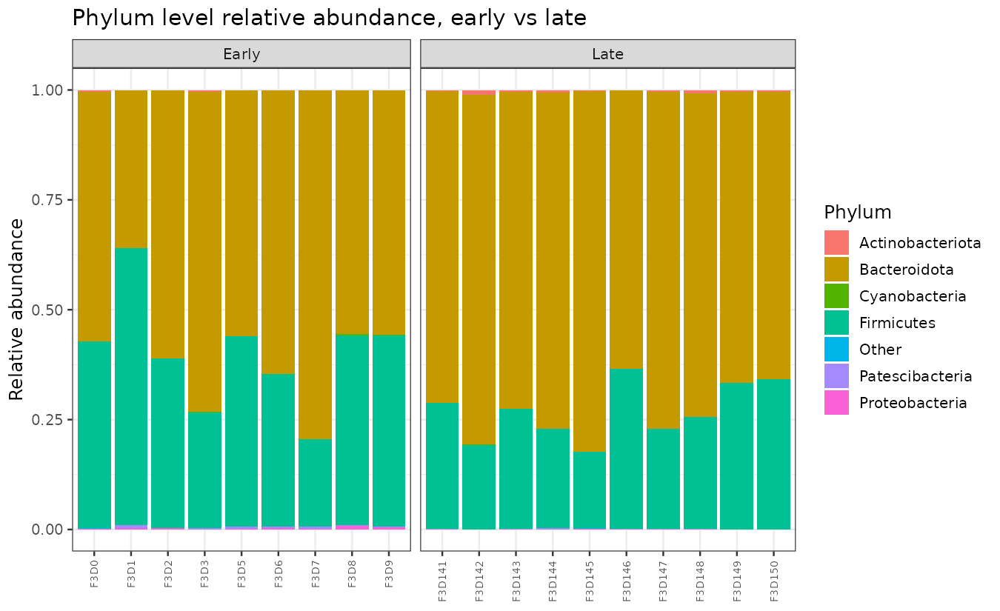
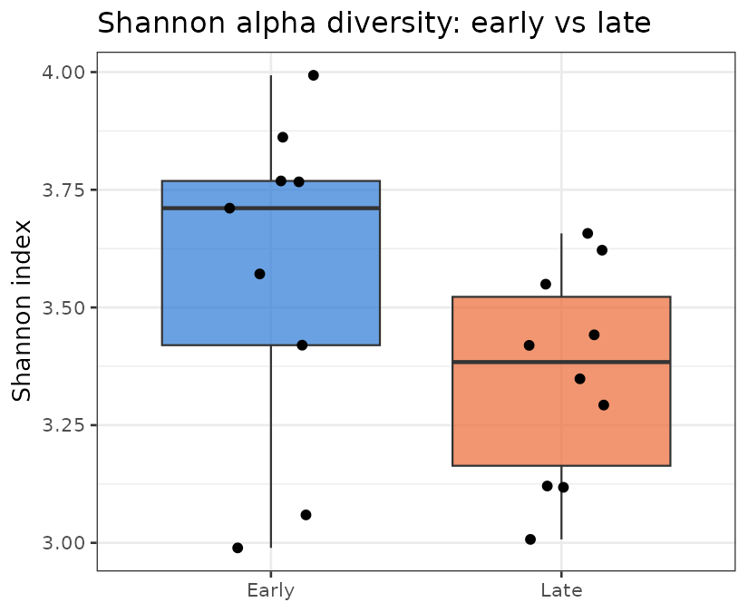
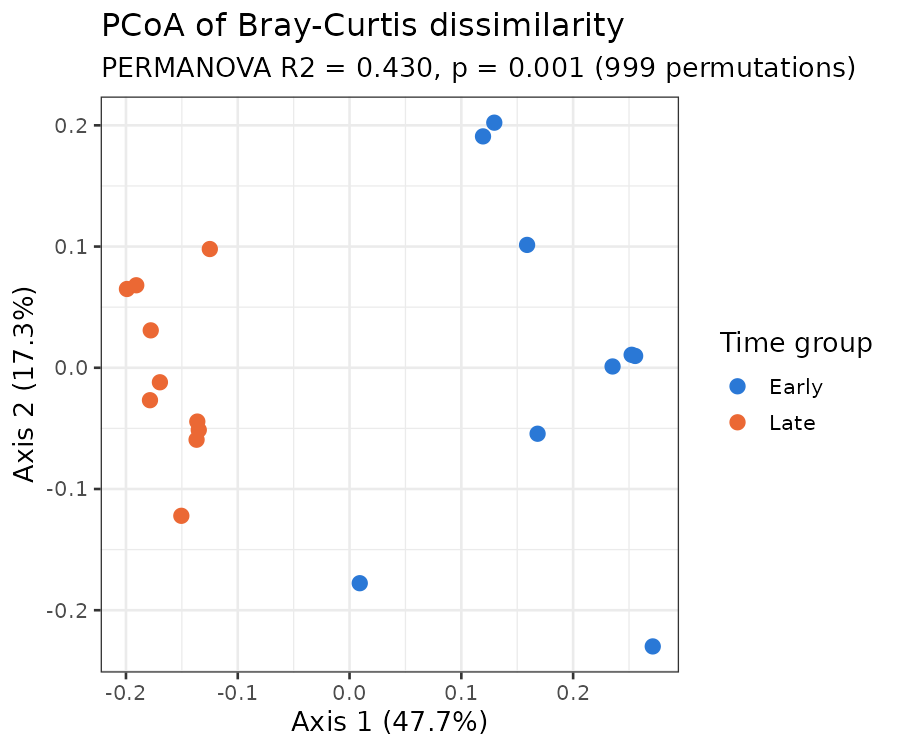

# Gut Microbiome Diversity Analysis (DADA2)

A 16S rRNA amplicon pipeline that infers exact amplicon sequence variants (ASVs) with DADA2, assigns taxonomy against SILVA, and compares gut microbial community diversity and composition between two real, biologically distinct time points in the same mice.

## Technologies used

R, DADA2, phyloseq, vegan (PERMANOVA), ANCOM-BC2, ggplot2.

## Biological background

The gut microbiome changes dramatically in early life as an animal is weaned off milk onto solid food, and a central question in microbiome research is how quickly, and in what way, that community stabilizes afterward. This matters beyond mice: early life gut microbiota development is linked to immune and metabolic development in humans too, and the statistical toolkit used here (ASV inference, alpha and beta diversity, PERMANOVA, compositionally aware differential abundance testing) is the same toolkit used in human gut microbiome studies, just applied to a dataset that is actually feasible to run end to end on a laptop.

## Dataset

This is real paired-end MiSeq 16S rRNA V4 amplicon data from mouse fecal (gut) samples, originally generated by Kozich et al. 2013 (*Applied and Environmental Microbiology*) to validate the dual-index MiSeq sequencing protocol that much of the 16S field still uses, and distributed by the Schloss lab as the "MiSeq SOP" tutorial dataset (the same dataset the official DADA2 tutorial itself is built on).

- Source: [mothur MiSeq SOP dataset](https://mothur.org/wiki/miseq_sop/), real mouse fecal samples from a single set of mice sampled at two real time points
- Samples used here: 19 real biological samples, 9 "Early" (days 0 to 9 post weaning: F3D0, F3D1, F3D2, F3D3, F3D5, F3D6, F3D7, F3D8, F3D9) and 10 "Late" (days 141 to 150 post weaning: F3D141 through F3D150)
- A day 4 sample (F3D4) is absent from the original deposited dataset; that gap is in the source data, not something this project introduced
- Excluded: a Mock community sample (`Mock_S280_*`), a sequencing control used to validate error rates, not a biological sample, so it is not part of the diversity comparisons
- 147,581 total raw read pairs across the 19 samples (full distribution in `results/tables/reads_tracked_through_pipeline.csv`)
- Reference: [SILVA SSU r138.1 NR99](https://zenodo.org/records/4587955) genus level training set for taxonomy assignment

**A small example subset is committed** at `data/raw/example_subset/` so the repo is browsable without a download step; the full 19 sample dataset and the SILVA reference are gitignored (see "How to run it").

## Workflow

1. Quality profile the raw reads, then filter and trim (`filterAndTrim`): forward reads truncated at 240 bp (quality stays high through this length), reverse reads truncated harder at 160 bp (quality drops off earlier, typical for Illumina paired-end runs), leaving comfortable overlap for the ~253 bp V4 amplicon
2. Learn each run's error model and denoise with DADA2's core algorithm (`learnErrors`, `dada`), independently for forward and reverse reads
3. Merge paired reads, build the ASV table, and remove chimeras (`removeBimeraDenovo`)
4. Assign genus level taxonomy against SILVA v138.1 (`assignTaxonomy`)
5. Build a `phyloseq` object; compute alpha diversity (Shannon, Chao1) and beta diversity (Bray-Curtis, PCoA, PERMANOVA via `vegan::adonis2`)
6. Genus level differential abundance between Early and Late with ANCOM-BC2, which corrects for the compositional nature of relative abundance data instead of comparing proportions directly

The four steps above are four ordered R scripts in `scripts/`, run directly with `Rscript` (see "How to run it"). This portfolio's other two pipelines orchestrate with Snakemake; this one deliberately does not; see the note under "How to run it" for why.

## How to run it

```bash
# 1. Create the environment
mamba env create -f environment.yml
conda activate gut-microbiome-diversity-analysis

# 2. Get the data (not committed to this repo, see Dataset above)
mkdir -p data/raw && cd data/raw
curl -sSL -o miseqsopdata.zip "https://mothur.s3.us-east-2.amazonaws.com/wiki/miseqsopdata.zip"
unzip miseqsopdata.zip
cd ../..

mkdir -p data/reference
curl -sSL -o data/reference/silva_nr99_v138.1_train_set.fa.gz \
  "https://zenodo.org/records/4587955/files/silva_nr99_v138.1_train_set.fa.gz"

# 3. Run the four steps in order
Rscript scripts/01_dada2_asv_inference.R
Rscript scripts/02_taxonomy.R
Rscript scripts/03_phyloseq_diversity.R
Rscript scripts/04_differential_abundance.R
```

**Why plain scripts instead of Snakemake, unlike this portfolio's other two pipelines.** Snakemake needs a Python new enough to run it, but this project's R/Bioconductor solve independently pulled in Python 3.13, which the pinned Snakemake version here (7.32, matching the other pipelines) cannot run on; the other two pipelines solve this by keeping Snakemake in its own separate, small environment. On this specific machine's 7 GB of RAM, solving a second full environment just to add that orchestration layer on top of an already heavy R/Bioconductor install was not worth it for a four script pipeline with one linear dependency chain. Running the four scripts directly, in order, is the honest, reproducible alternative; it is simply four `Rscript` calls instead of one `snakemake` call.

Expected runtime: under 10 minutes total on a 4 thread budget on a 7 GB RAM machine (verified; the ASV inference step is the slowest at about 3 to 4 minutes, taxonomy assignment against the full SILVA reference a further 1 to 2 minutes). Deliberately run with `multithread = 4` rather than all available cores: an earlier run with unrestricted threading crashed the WSL2 VM outright on this machine, consistent with this being a genuinely memory constrained environment, not just a slow one.

## Results and interpretation

**ASV inference.** Of 147,581 raw read pairs, 96.3% of post-merge reads survived chimera removal, yielding 218 ASVs ranging 251 to 255 bp (consistent with the expected V4 amplicon length). Per-sample read tracking through every pipeline step is in `results/tables/reads_tracked_through_pipeline.csv`.

**Taxonomy.** All 218 ASVs were classified at the Phylum level (0 unclassified), and the community is overwhelmingly Firmicutes (184 ASVs) and Bacteroidota (17 ASVs), with Proteobacteria, Actinobacteriota, Cyanobacteria, Patescibacteria, Deinococcota and Verrucomicrobiota each contributing a handful of ASVs. That Firmicutes/Bacteroidota dominance is exactly what is expected for a healthy mouse gut community.



**Alpha diversity: not significantly different.** Shannon diversity (Wilcoxon rank-sum, W = 65, p = 0.113) and Chao1 richness (W = 64, p = 0.133) did not differ significantly between Early and Late samples.



**An honest caveat on Chao1 for ASV data.** In this dataset, Chao1 is numerically identical to the simple Observed ASV count for every single sample (`results/tables/alpha_diversity.csv`), because DADA2's denoising removes singletons by design, and Chao1's richness estimator is a correction based on the ratio of singleton and doubleton counts. With no singletons left to correct with, the correction term is zero and Chao1 degenerates to a plain count. Chao1 is reported here because it was asked for, but on ASV tables (as opposed to traditional OTU tables) it is not adding information beyond the observed ASV count, and that is a property of the ASV method, not a bug in this analysis.

**Beta diversity: a strong, significant difference.** Despite similar alpha diversity, community composition is clearly different: PERMANOVA on Bray-Curtis dissimilarity found time group explains 43.0% of the variance in community composition (R2 = 0.430, p = 0.001, 999 permutations).



Put plainly: the two time points don't differ much in how diverse the community is, but they differ a great deal in which specific taxa make it up, which the PCoA plot shows directly as two visually separated clusters.

**Differential abundance (ANCOM-BC2, genus level).** Of 57 genera, 14 were structural zeros (absent entirely from one group, which ANCOM-BC2 handles separately rather than testing), leaving 43 testable genera. 9 were significantly differentially abundant (q < 0.05, Benjamini-Hochberg corrected):

| Genus | Phylum | log fold change (Late vs Early) | q-value |
|---|---|---|---|
| Lactobacillus | Firmicutes | +1.96 | 0.0021 |
| Turicibacter | Firmicutes | +1.90 | 0.0021 |
| Anaerotruncus | Firmicutes | +1.29 | 0.0021 |
| Lachnospiraceae UCG-004 | Firmicutes | +0.92 | 0.0266 |
| Enterorhabdus | Actinobacteriota | +0.88 | 0.0278 |
| Lachnospiraceae UCG-006 | Firmicutes | +0.75 | 0.0311 |
| Lachnospiraceae UCG-001 | Firmicutes | -2.14 | 0.0016 |
| Clostridium sensu stricto 1 | Firmicutes | -2.09 | 0.0016 |
| (unresolved genus, ASV117) | Firmicutes | -1.26 | 0.0278 |

Full table (including non-significant genera, standard errors, and the structural zero flags) is in `results/tables/ancombc_differential_abundance_genus.csv`. This README reports all 9 significant hits, not a cherry-picked subset of them.

## Limitations

- **Real data, but a single experiment.** 19 samples from what appears to be a single cohort of mice, not an independent replication cohort; conclusions are about this dataset, not a general claim about all mice
- **Genus level only.** SILVA's naive Bayesian classifier was run to genus level, not species; several significant hits (Lachnospiraceae UCG-001, UCG-004, UCG-006) are already at the limit of what 16S V4 data can resolve within that family
- **Chao1 is degenerate for ASV tables**, as explained above; Observed richness and Shannon are the metrics actually worth reading here
- **No multiple hypothesis correction across the different diversity analyses** as a family; the Benjamini-Hochberg correction inside the ANCOM-BC2 result applies within that one test, not across alpha diversity, PERMANOVA, and differential abundance as a combined set
- **16S, not shotgun metagenomics.** Genus level (not species or strain level) resolution and no direct functional (gene content) inference

## Future improvements

- [ ] Species level taxonomy with the SILVA species add-on reference, where V4 resolution allows it
- [ ] PICRUSt2 functional prediction from the 16S profile, to turn "which taxa changed" into "which pathways changed"
- [ ] Add a second real cohort to check whether the Early/Late separation reported here replicates
- [ ] Compare ANCOM-BC2 against a second differential abundance method (for example ALDEx2) to see whether the 9 significant genera are robust to the choice of method
- [ ] UniFrac (phylogenetic) beta diversity alongside Bray-Curtis, which needs a reference tree this analysis does not currently build
- [ ] Resolve the Snakemake/Python version conflict (pin a newer Snakemake release compatible with Python 3.13, or isolate it in its own environment as the other two pipelines do) so this project can be orchestrated the same way as the rest of the portfolio

## Contact / links

GitHub: [MohamedElsaid-bit](https://github.com/MohamedElsaid-bit)
Portfolio: [mohamedelsaid-bit.github.io/Portfolio-](https://mohamedelsaid-bit.github.io/Portfolio-/)
